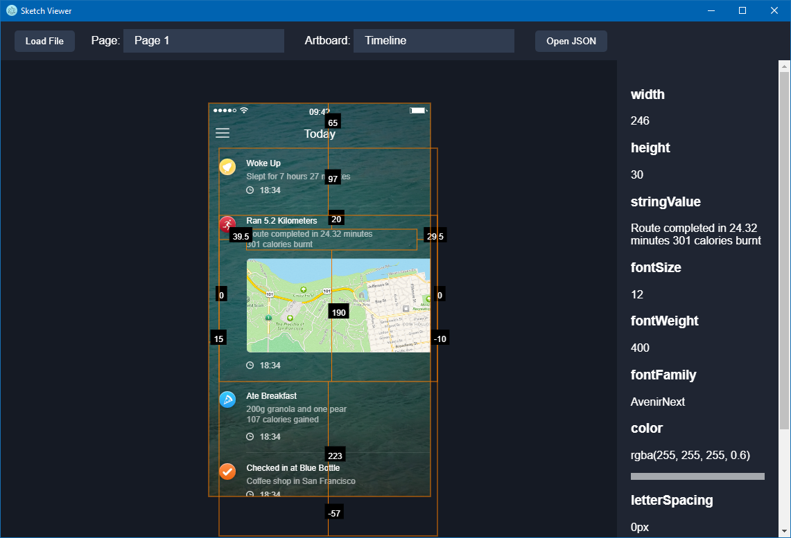

# Sketch Viewer

An inspector application for Sketch 43+ open format files.

Basic Sketch functionality has been implemented so far, but plenty of features are either inaccurate or missing.
If you find any issues, please forward a sample Sketch file with the expected output.

This application is intended for developers. 
There's no plans to make this an editor for Sketch files. 



## Motiviation

While there is services like Invision out there, there's a few problems with it. Here's some of the main reasons why I decided to develop this app and what separates it from others:

* No need to upload confidential concepts to third-party servers.
* More advanced inspect functionality thanks to being rendered at runtime.
* Ability to export SVGs from the app directly through the inspector.
* Free and open-source. 

## Installation

```npm install```
```npm start```

## How to Use

* Load Sketch file.
* Select the page you want to view, and the artboard in that page.
* If you want to see the raw Sketch JSON, click "Open JSON".
* You can pan by holding down the left mouse button and moving the mouse.
* You can zoom using the mouse wheel.
* Hovering over elements provides measurements.
* Click on an element to see further information on the right panel.
* You can right-click and inspect to see the actual HTML code for the render. 

## Troubleshooting

### Fonts are not working

Install the font globally on your system.

## Known Issues
* Symbol Overrides not implemented.

